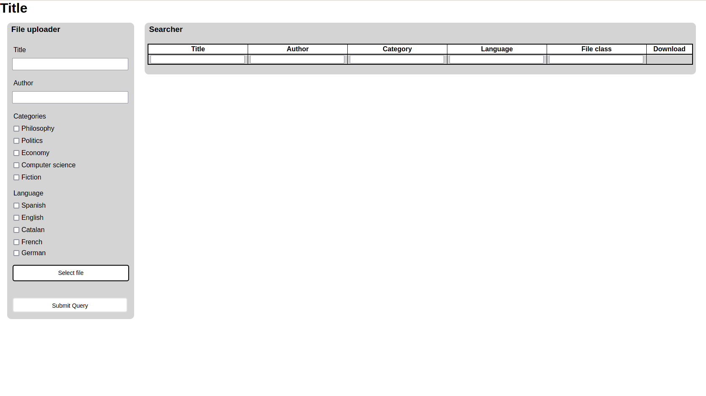

# Books admistration server

A simple to use webserver to administrate a digital library, accepting all class of files and allowing the users to download and upload any file. The user when uploads the file has to specify  title, the author, select one of the genres avariable and the language in which is written the document.

Also the user can apply filters to search for specific books, having the posibility to filter by the name, the author, the category, the language and the file format.

## Installation guide

You need the Python framework Tornado, which is installed by this way:

```
pip3 install tornado
```

Then you only have to execute the server using the command:

```
python3 main.py
```

## Captures

### Screenshot without any file uploaded

